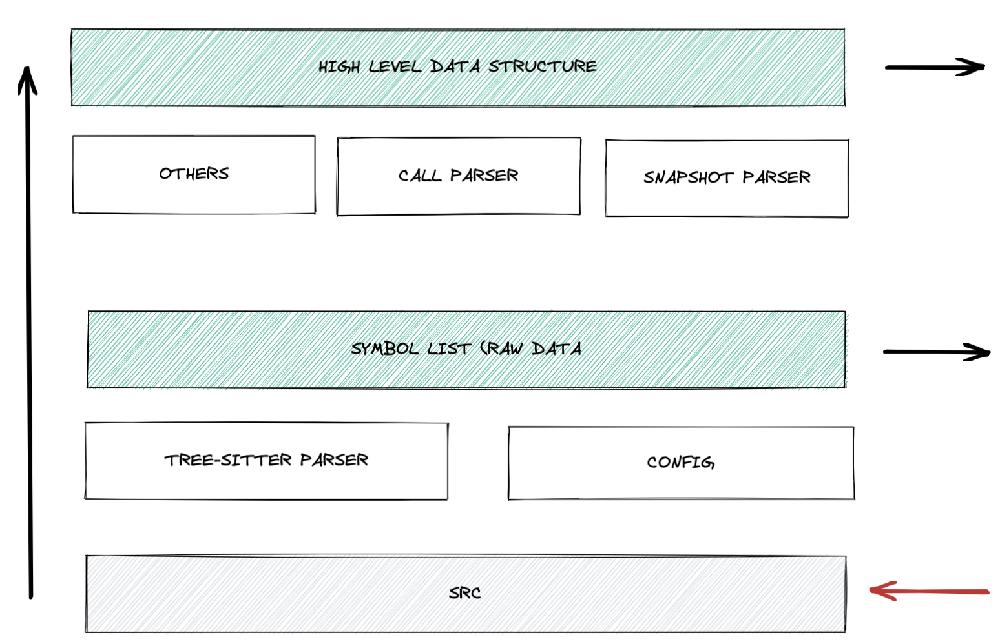

# sibyl 2

> Parsing, analyzing source code across many languages, and extracting their metadata easily.

快速、简单地从你的源码中提取可序列化的元信息。

## 使用

### 命令行

可以在 [release页面](https://github.com/williamfzc/sibyl2/releases) 下载对应平台的版本。

```bash
./sibyl2_0.2.0_darwin_amd64 extract --src ~/YOUR_SOURCE_CODE_DIR --lang GOLANG --type func
```

即可提取出整个仓库里所有的函数信息：

```json
[
  {
    "path": "foo/bar/a.go",
    "language": "GOLANG",
    "type": "func",
    "units": [
      {
        "name": "NormalFunc",
        "receiver": "",
        "parameters": [
          {
            "type": "*sitter.Language",
            "name": "lang"
          },
          {
            "type": "int",
            "name": "ok"
          }
        ],
        "returns": [
          {
            "type": "string",
            "name": "aaa"
          },
          {
            "type": "error",
            "name": "n"
          }
        ],
        "span": {
          "start": {
            "row": 8,
            "column": 0
          },
          "end": {
            "row": 10,
            "column": 1
          }
        }
      }
    ]
  }
]
```

### API

TODO

## FAQ

### 关于 sibyl 1

- 详见《[sibyl 1 的不足](https://github.com/williamfzc/sibyl#2022-09-24)》。

### 源码分析 vs 制品分析

通常分析工具分为两种：

- 制品分析：如[soot](https://github.com/soot-oss/soot)，从语言中间层（字节码）的角度进行信息提取；
- 源码分析：如目前 github 官网中使用的 [semantic](https://github.com/github/semantic)，直接解析代码文本而不需要编译；

我们选择了后者，原因：

- 信息差异
  - 在中大型项目中，
    - 编译过程经常会影响原有的代码（如AOP），无论是AST还是字节码；
    - 安全加固的考虑，强化制品反编译的难度；
  - 在制品分析时我们难以完全复原它原有的样子；
  - 我们关心且能够直接优化的载体是源码，而不是制品；
- 兼容性
  - 不是所有的语言都有方便如java的反编译工具；

## arch



## refs

- basic grammar: https://tree-sitter.github.io/tree-sitter/creating-parsers#the-grammar-dsl
- language parser (for example, golang): https://github.com/tree-sitter/tree-sitter-go/blob/master/src/parser.c 
- symbol: https://github.com/github/semantic/blob/main/docs/examples.md#symbols
- stack graphs: https://github.blog/2021-12-09-introducing-stack-graphs/

## license

[MIT](LICENSE)
