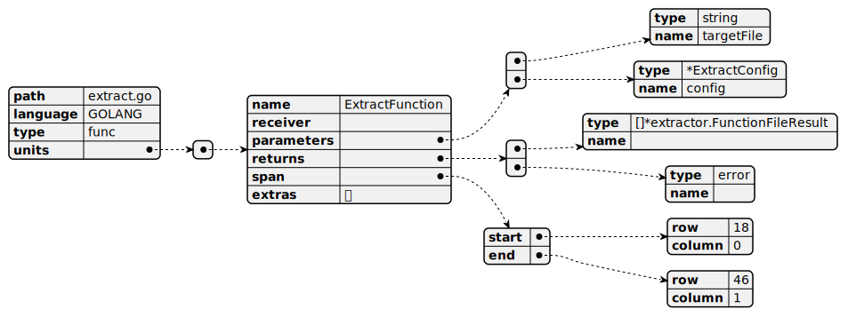

# sibyl 2

> Take a quick snapshot of your codebase in seconds, with zero cost.


## What's it?

sibyl2 is a static code analyzer, for extracting meta-data (functions/classes/parameters/lines ...) from raw source code. Inspired by [semantic](https://github.com/github/semantic) of GitHub.

- Easy to use
- Fast enough
- Extensible
- Multiple languages in one (Go/Java/Python ...)

It can translate raw source code:

```go
func ExtractFunction(targetFile string, config *ExtractConfig) ([]*extractor.FunctionFileResult, error) {
// ...
}
```

to logical structure：



all you need is a one-line command:

```bash
./sibyl extract --src . --output hello.json
```

and export them with different formats.

<details><summary>... JSON format for your custom operations</summary>

```json
{
  "path": "extract.go",
  "language": "GOLANG",
  "type": "func",
  "units": [
    {
      "name": "ExtractFunction",
      "receiver": "",
      "parameters": [
        {
          "type": "string",
          "name": "targetFile"
        },
        {
          "type": "*ExtractConfig",
          "name": "config"
        }
      ],
      "returns": [
        {
          "type": "[]*extractor.FunctionFileResult",
          "name": ""
        },
        {
          "type": "error",
          "name": ""
        }
      ],
      "span": {
        "start": {
          "row": 18,
          "column": 0
        },
        "end": {
          "row": 46,
          "column": 1
        }
      },
      "extras": null
    }
  ]
}
```

</details>

<details><summary>... And multiple languages supported</summary>

```java
public class Java8SnapshotListener extends Java8MethodLayerListener<Method> {
    @Override
    public void enterMethodDeclarationWithoutMethodBody(
            Java8Parser.MethodDeclarationWithoutMethodBodyContext ctx) {
        super.enterMethodDeclarationWithoutMethodBody(ctx);
        this.storage.save(curMethodStack.peekLast());
    }
}
```

after:

```json
{
	"name": "enterMethodDeclarationWithoutMethodBody",
	"receiver": "com.williamfzc.sibyl.core.listener.java8.Java8SnapshotListener",
	"parameters": [{
		"type": "Java8Parser.MethodDeclarationWithoutMethodBodyContext",
		"name": "ctx"
	}],
	"returns": [{
		"type": "void",
		"name": ""
	}],
	"span": {
		"start": {
			"row": 8,
			"column": 4
		},
		"end": {
			"row": 13,
			"column": 5
		}
	},
	"extras": {
		"annotations": ["@Override"]
	}
}
```

</details>

## Usage examples

Developers can easily combine it with any other tools. We have already built some cmd tools in use.

### Default Functions

TODO

### Source Code History Visualization

Source code history visualization, inspired by https://github.com/acaudwell/Gource

One line command to see how your repository grow up, with no heavy dependencies like OpenGL, with logic level messages.

```bash
./sibyl history --src . --output hello.html
```

### Smart Git Diff

Normal git diff has only text level messages.

```bash
./sibyl diff --from HEAD~1 --to HEAD --output hello1.json
```

And you can get a structural one with sibyl, which contains method level messages and callgraphs.

```bash
{
  "fragments": [
    {
      "path": "pkg/server/admin_s.go",
      "functions": [
        {
          "name": "HandleStatusUpload",
          "receiver": "",
          "parameters": [
            {
              "type": "*gin.Context",
              "name": "c"
            }
          ],
          "returns": null,
          "span": {
            "start": {
              "row": 17,
              "column": 0
            },
            "end": {
              "row": 23,
              "column": 1
            }
          },
          "extras": {},
          "path": "pkg/server/admin_s.go",
          "language": "GOLANG",
          "calls": null,
          "reverseCalls": [
            {
              "name": "Execute",
              "receiver": "",
              "parameters": [
                {
                  "type": "ExecuteConfig",
                  "name": "config"
                }
              ],
              "returns": null,
              "span": {
                "start": {
                  "row": 67,
                  "column": 0
                },
                "end": {
                  "row": 96,
                  "column": 1
                }
              },
              "extras": {},
              "path": "pkg/server/app.go",
              "language": "GOLANG"
            }
          ]
        }
      ]
    },
    ...
```

## Principle

Many devtools required meta-data inside source code for further processing. For example, code coverage, call graph, etc.

Without a cross-languages shared lib, we have to re-implement this extract layer repeatedly for each tool, each language.

This repo aims at offering a general use shared lib for **source code meta-data**.

## Performance

TODO

## Contribution

This project split into 3 main parts:

- /cmd: Pure command line tool for general usage
- /pkg/server: All-in-one service for production
- others: Shared api and core

Workflow:

- core: collect files and convert them to `Unit`.
- extract: classify and process units into functions, symbols.
- api: higher level analyze like callgraph

Issues / PRs are welcome!

## Refs

- basic grammar: https://tree-sitter.github.io/tree-sitter/creating-parsers#the-grammar-dsl
- language parser (for example, golang): https://github.com/tree-sitter/tree-sitter-go/blob/master/src/parser.c
- symbol: https://github.com/github/semantic/blob/main/docs/examples.md#symbols
- stack graphs: https://github.blog/2021-12-09-introducing-stack-graphs/

## License

Apache License Version 2.0, see [LICENSE](LICENSE)
